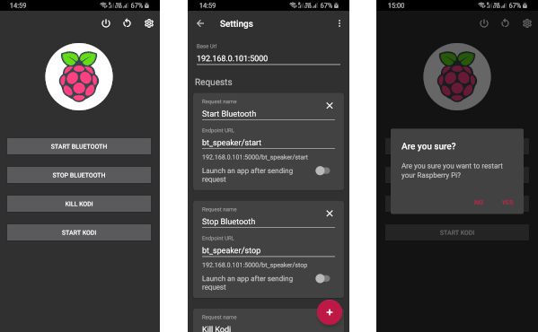

# HomeBerry - your Raspberry Pi remote controller

HomeBerry is a simple Android app that allows you to control your Raspberry PI through a REST API. Please note, that you must install this API on the Pi. For that, please check out [HomeBerry API](https://github.com/AmkSk/homeberry-api) repository.

 

## App features

- Simple and nice interface for calling requests (HTTP GET)
- Settings screen for creating / editing existing requests
- Option to import / export your configuration to a json file
- Android App Shortcuts - launch your requests directly from the launcher (only first four requests will show up)

## How to install

Please find the Android apk file in the [releases](https://github.com/AmkSk/homeberry/releases).

## Donate

If you enjoy using HomeBerry, please consider donating.

### Bitcoin

38nYdr2N3NJP6dV1cFfYVKeDvQ5UG9ff9S

### Paypal

